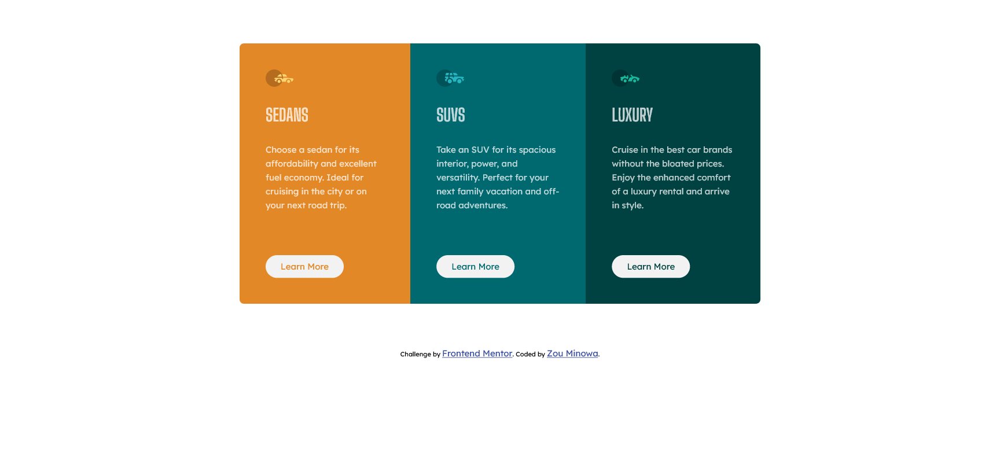

# Frontend Mentor - 3-column preview card component solution

This is a solution to the [3-column preview card component challenge on Frontend Mentor](https://www.frontendmentor.io/challenges/3column-preview-card-component-pH92eAR2-).

## Table of contents

- [Overview](#overview)
  - [The challenge](#the-challenge)
  - [Screenshot](#screenshot)
  - [Links](#links)
- [My process](#my-process)
  - [Built with](#built-with)
  - [What I learned](#what-i-learned)
  - [Continued development](#continued-development)
  - [Useful resources](#useful-resources)
- [Author](#author)

**Note: Delete this note and update the table of contents based on what sections you keep.**

## Overview

### The challenge

Users should be able to:

- View the optimal layout depending on their device's screen size
- See hover states for interactive elements

### Screenshot




### Links

- Solution URL: [https://github.com/Zomino/fm-3-column-preview-card-component](https://github.com/Zomino/fm-3-column-preview-card-component)
- Live Site URL: [https://zomino.github.io/fm-3-column-preview-card-component/](https://zomino.github.io/fm-3-column-preview-card-component/)

## My process

### Built with

- HTML
- CSS
- Flexbox
- CSS Grid
- Mobile-first workflow

### What I learned

- Descendant selectors can help reduce the number of classes required for styling.
- rems can be used to make elements scale based on a single base value (font size).
- CSS 'not' selectors can help cut down on repeated code.

I was proud of this CSS selector which selects everything inside of a flex-item that is not a button. This allowed me to add a margin underneath everything inside of a flex-item except the button, which didn't need margin below it since it sits at the bottom.

```css
.flex-item :not(button) {
  margin-bottom: 2rem;
}
```

I was also proud of this flex-grow property I added to the p tags. This was a simple solution to the issue of buttons not aligning in the desktop design.

```css
.flex-item p {
  flex-grow: 1;
  line-height: 1.6;
  color: var(--transparent-white);
}
```

### Continued development

I would like to develop my understanding of when and when not to use relative CSS units.

### Useful resources

- [Web Dev Simplified - Learn CSS Units In 8 Minutes](https://www.youtube.com/watch?v=-GR52czEd-0) - This is a quick overview of CSS units that really helped me to better understand relative units.
- [A Complete Guide to Flexbox](https://css-tricks.com/snippets/css/a-guide-to-flexbox/) - This article really helps me to visualise how Flexbox works.

## Author

- Frontend Mentor - [@Zomino](https://www.frontendmentor.io/profile/Zomino)